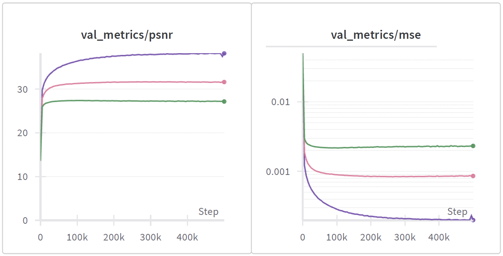
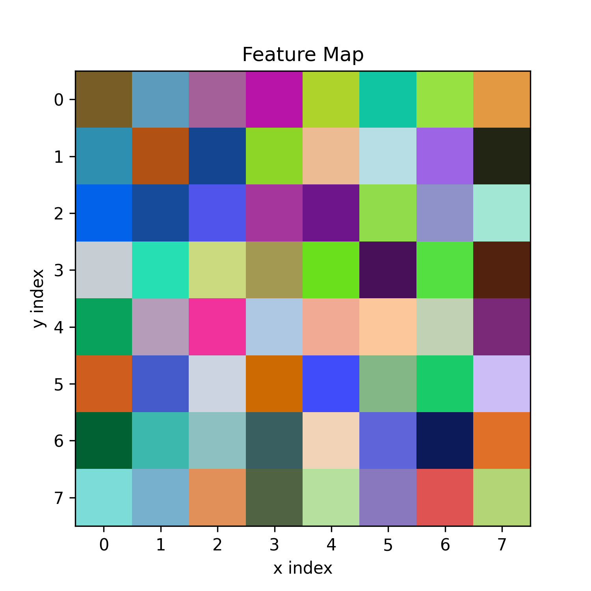
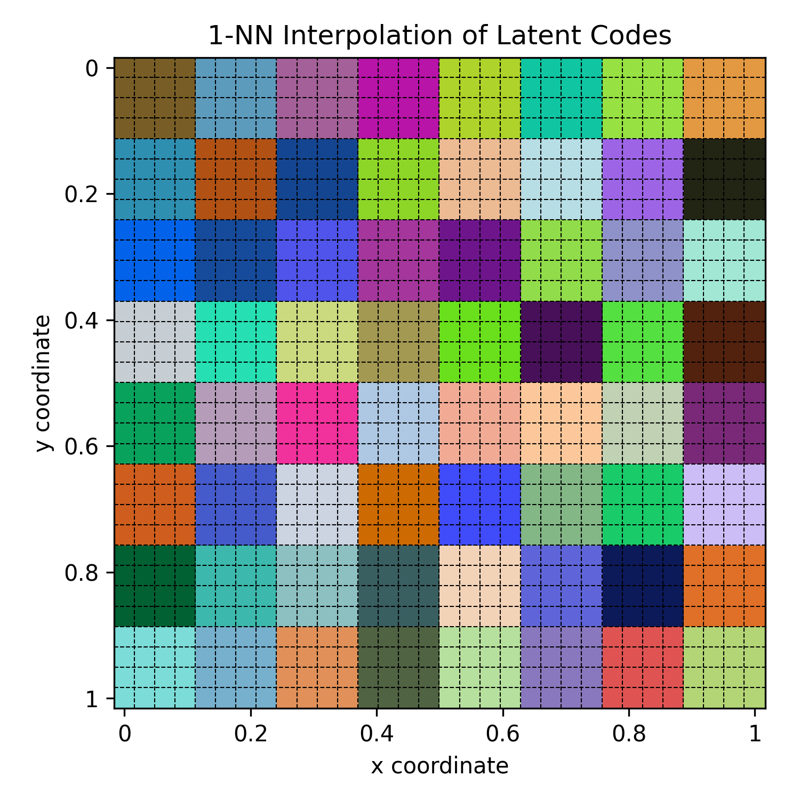
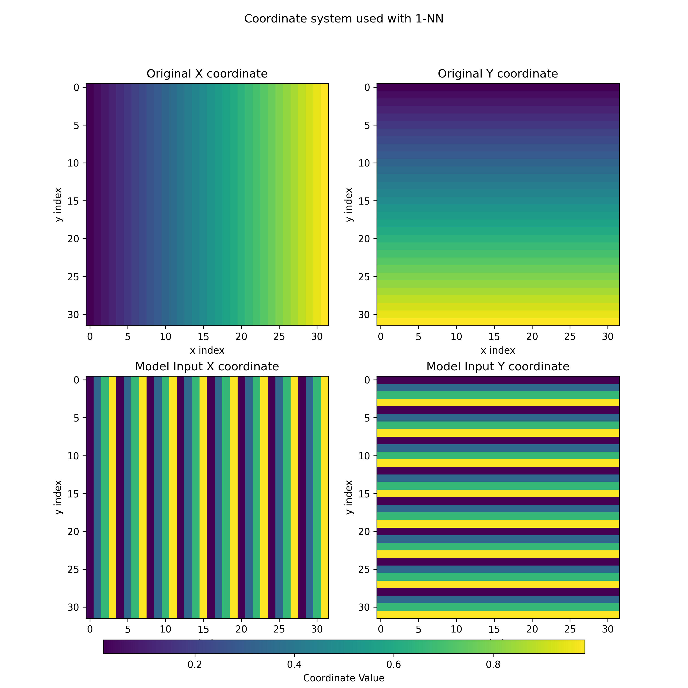
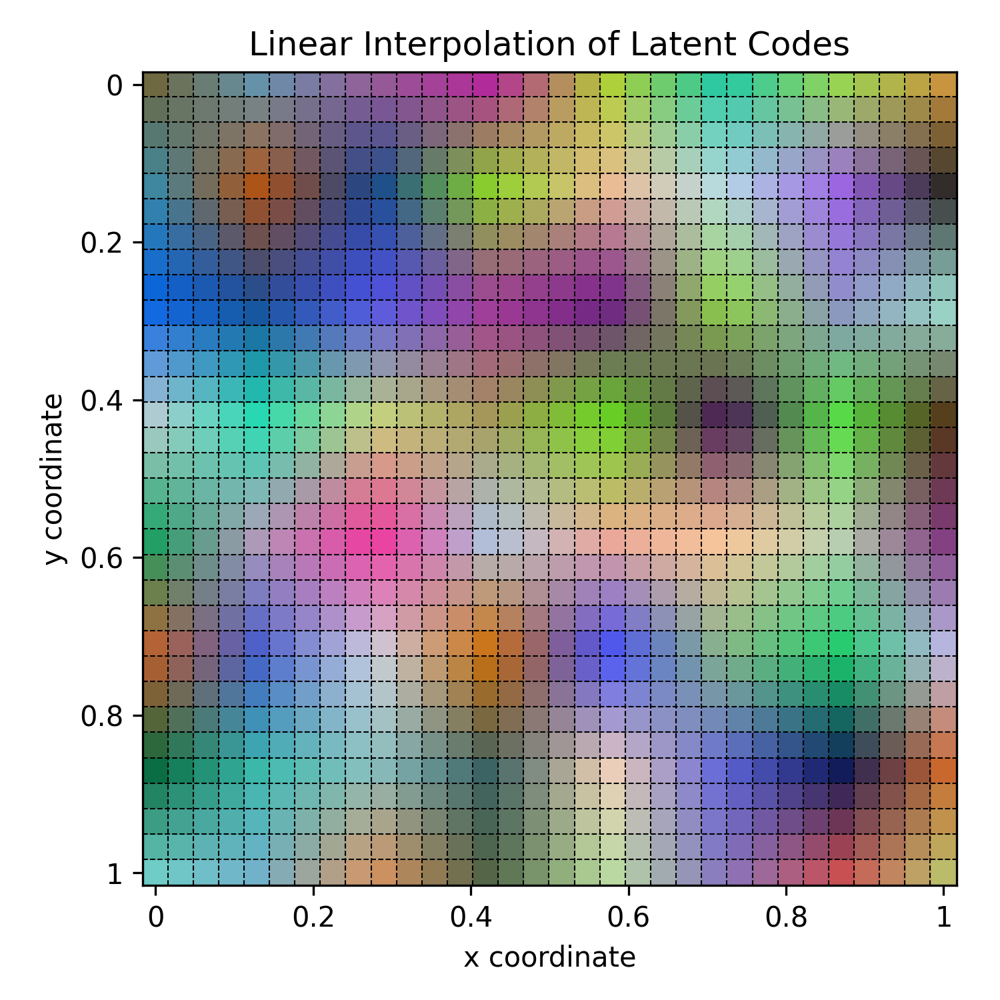
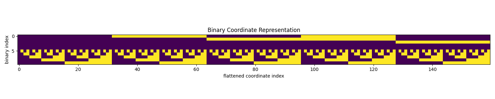

# An unofficial implementation of *spatial functa* 🌌

This is an unofficial implementation of Spatial Functa by Samuele Papa. The original paper can be found [here](https://arxiv.org/abs/2302.03130). The original authors are Matthias Bauer, Emilien Dupont, Andy Brock, Dan Rosenbaum, Jonathan Richard Schwarz, and Hyunjik Kim.

*Spatial functa* is an improvement upon *functa*. The authors have released the source code for *functa*, however, not for *spatial functa*. This repository introduces a few fundamental changes (use of `flax` and shared backbone parameters), but tries to match the original *functa* implementation when possible.

If you use this repository in your paper, please cite the original work and this repository in your work (or in the aknowledgments), using this:

```
@article{bauer2023spatial,
  title={Spatial functa: Scaling functa to imagenet classification and generation},
  author={Bauer, Matthias and Dupont, Emilien and Brock, Andy and Rosenbaum, Dan and Schwarz, Jonathan Richard and Kim, Hyunjik},
  journal={arXiv preprint arXiv:2302.03130},
  year={2023}
}
@misc{spatialrepo2024papa,
	author = {Papa, Samuele},
	title = {Unofficial implementation of spatial functa},
	howpublished = {\url{https://github.com/samuelepapa/spatial-functa}},
	year = {2024},
	note = {[Accessed 21-06-2024]},
}
```

Contents of this README:

- [Installation](#installation)
- [Usage](#usage)
    - [Fitting](#fitting)
    - [Downstream tasks](#downstream-tasks)
- [Experimental results](#method-discussion-and-experimental-results)


## Installation
You must have JAX and the CPU version of PyTorch (also the CUDA version of PyTorch works, just not necessary) installed. You can install the packages by running the following commands (remember to change JAX and PyTorch installs based on your system requirements):
```bash
conda create -n spatial_functa python=3.11

conda activate spatial_functa

pip install -U "jax[cuda12]"

pip3 install torch torchvision torchaudio --index-url https://download.pytorch.org/whl/cpu

pip install -e .
```

## Usage
### Fitting
To fit a model with default parameters and dataset simply run the following:

```bash
python experiments/fitting/train.py
```

*Note that the environment variable `DATA_PATH` is used to point to the root of the datasets' directory for convenience*.

The library uses `ml_collections` to manage config. To change dataset, just do the following (for now only MNIST and CIFAR10 have been implemented):

```bash
python experiments/fitting/train.py --dataset=experiments/config/datset.py:mnist
```

To change the model parameters do something similar to the following:

```bash
python experiments/fitting/train.py --model.num_layers=12 --model.omega_0=15 --config.experiment_dir=/path_to_experiment_dir/ --config.train.checkpointing.checkpoint_dir=/path_to_experiment_dir/ckpts/
```

### Downstream tasks

To perform downstreamtasks, you first need to create the *functaset*, using the following:

```bash
python experiments/downstream/create_functaset.py \
--config.functa_model_dir=/path_to_experiment_dir/ \
--functaset=experiments/downstream/config/functaset.py:cifar10 \
--functaset.path=functa_cifar10_256
```

The `config.functaset.path` is relative to the `DATA_PATH` environment variable. The script creates an [hdf5](https://en.wikipedia.org/wiki/Hierarchical_Data_Format) file for the training, one for the validation and one for testing based on the training/validation/test splits for the chosen dataset. The dataset can be modified using the `dataset.py` config file, where one can also control the number of augmentations to apply to the training set. The dataset is then by default loaded into RAM. We suggest changing the dataloader and/or storage method is much larger datasets are needed and do not fit in RAM.

Then, the downstream model can be trained. Use the following to train a transformer:

```bash
python experiments/downstream/train.py --functaset=experiments/downstream/config/functaset.py:cifar10 --functaset.path=functa_cifar10_256 --model=experiments/downstream/config/classifier_model.py:mlp -model.hidden_dim=1024 --model.num_layers=3
```

## Method Discussion and Experimental Results

### Repoducing `functa`

These are preliminary results for `functa` on CIFAR10. The model uses the same hyperparamters as the ones used in the spatial functa paper, including the 50 augmentations per sample for downstream classification. 

| Latent Size| Val PSNR | Val Acc |
|------|-----|-----|
|256| 27.16| 65.9% |
|512| 31.62 | 67.2% |
|1024| 38.19| 66.6% |




*Figure 1. Training curves for functa on CIFAR10*

### Reproducing `spatial functa`

For more information, please refer to this [wandb report](https://wandb.ai/neuralfield-wandb/spatial_functa/reports/Reproducing-Spatial-Functa--Vmlldzo4ODQ1OTQx). The model is currently unstable when using the hyperparameters provided in the paper. Decreasing the outer learning rate makes the training stable but also makes the model obtain a worse PSNR. No downstream performance has been yet evaluated.

**Here some crucial differences from `functa` are reported.**

The model uses a feature map as latent (Figure 2). Then, given a coordinate (x,y), two strategies are used to obtain the latent vector.



*Figure 2. Feature map of spatial functa*

#### 1-Nearest Neighbour and 2D interpolation
The first is simple 1-Nearest Neighbour, which picks the closes vector in the feature map assuming that the "real size" of the feature map is equal to the size of the image and that vectors in each position of the feature map are centered in their respective pixel. For example, given an image of size 32x32 pixels, and a feature map that is 8x8 (as in our examples), the resulting interpolation values can be seen in Figure 3. We can see how the feature map is effectively enlarged to match the resolution of the input image.



*Figure 3. Nearest Neighbour interpolation of the feature map. The dotted lines represent the delimitations of the queried pixels given the input image of size 32x32 pixels.*

When 1-NN is used, the authors also change the coordinates input to the model. Each small square is now indexed with values from 0 to 1, as the vector can already disambiguate where in the image we are. The resulting coordinates can be seen in Figure 4. This method still allows the neural field to be continuous wrt the input coordinates.



*Figure 4. Coordinate system used when 1-NN is used.*

The second strategy is to use bilinear interpolation, which results in a smoother interpolation of the feature map. The resulting interpolation values can be seen in Figure 5.



*Figure 5. Bilinear interpolation of the feature map. The dotted lines represent the delimitations of the queried pixels given the input image of size 32x32 pixels.*

When bilinear interpolation is used, the authors opt for a binarization of the input coordinates. This is done by calculating the binary representation of the current index of the pixel we wish to predict the RGB values for. The binary value is then concatenated into a single vector. For 32x32 images, this results in a 10-dimensional vector. The resulting coordinates can be seen in Figure 6.



