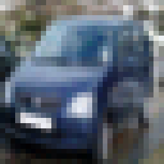

# An unofficial implementation of *spatial functa* 🌌

This is an unofficial implementation of Spatial Functa by ...

*Spatial functa* is an improvement upon *functa*. The authors have released the source code for *functa*, however, not for *spatial functa*. This repository introduces a few fundamental changes (use of `flax` and shared backbone parameters), but tries to match the original *functa* implementation when possible.

If you use this repository in your paper, please cite the original work and this repository in your work (or in the aknowledgments), using this:

```
@misc{spatialFunctaRepo,
	author = {Papa, Samuele},
	title = {Unofficial implementation of spatial functa},
	howpublished = {\url{https://github.com/samuelepapa/spatial-functa}},
	year = {2024},
	note = {[Accessed 21-06-2024]},
}
```

Contents of this README:

- [Experimental results](#experimental-results)
- [Installation](#installation)
- [Usage](#usage)
    - [Fitting](#fitting)
    - [Downstream tasks](#downstream-tasks)

## Experimental results

### Repoducing `functa`

These are preliminary results for `functa` on CIFAR10. The model uses a latent dimension of 256, `omega_0` of 30, 15 layers, 512 hidden dimension. Learning rate of 3e-6. Downstream model is an MLP with 3 layers and 1024 hidden dimension, 50 augmentations are used per signal, the latents are scaled by a constant factor, label smoothing is used, and a weight decay of 1e-1 is applied with learning rate of 1e-3.


| Num steps| Val PSNR | Val Acc |
|------|-----|-----|
|75k| 38.44| 59% |

|Original|| |  |
|---|-----|----|----|
|**Recon**|  |  |  |


## Installation
You must have JAX and the CPU version of PyTorch (also the CUDA version of PyTorch works, just not necessary) installed. You can install the packages by running the following commands (remember to change JAX and PyTorch installs based on your system requirements):
```bash
conda create -n spatial_functa python=3.11

conda activate spatial_functa

pip install -U "jax[cuda12]"

pip3 install torch torchvision torchaudio --index-url https://download.pytorch.org/whl/cpu

pip install -e .
```

## Usage
### Fitting
To fit a model with default parameters and dataset simply run the following:

```bash
python experiments/fitting/train.py
```

*Note that the environment variable `DATA_PATH` is used to point to the root of the datasets' directory for convenience*.

The library uses `ml_collections` to manage config. To change dataset, just do the following (for now only MNIST and CIFAR10 have been implemented):

```bash
python experiments/fitting/train.py --dataset=experiments/config/datset.py:mnist
```

To change the model parameters do something similar to the following:

```bash
python experiments/fitting/train.py --model.num_layers=12 --model.omega_0=15
```

### Downstream tasks

To perform downstreamtasks, you first need to create the *functaset*, using the following:

```bash
python experiments/downstream/create_functaset.py --config.functa_model_dir='path_to_experiment_folder' --config.functaset.path=spatial_cifar10
```

The `config.functaset.path` is relative to the `DATA_PATH` environment variable. The script creates a series of *banks*, each with a number of batches determined by `config.functaset.functa_bank_size_per_batch`. This is done to allow possible future batched loading in RAM, allow for soft failure of the dataset creation process (which would otherwise catastrofically fail), to allow for very large datasets to be loaded in RAM while being created, and make transfer of files easier. Note that different batch size, number of minibatches and number of devices can be used compared to what was done in training.

Then, the downstream model can be trained. Use the following to train a transformer:

```bash
python experiments/downstream/train.py --model=experiment/downstream/config/classifier_model.py:transformer --config.functaset.path=spatial_cifar10
```

